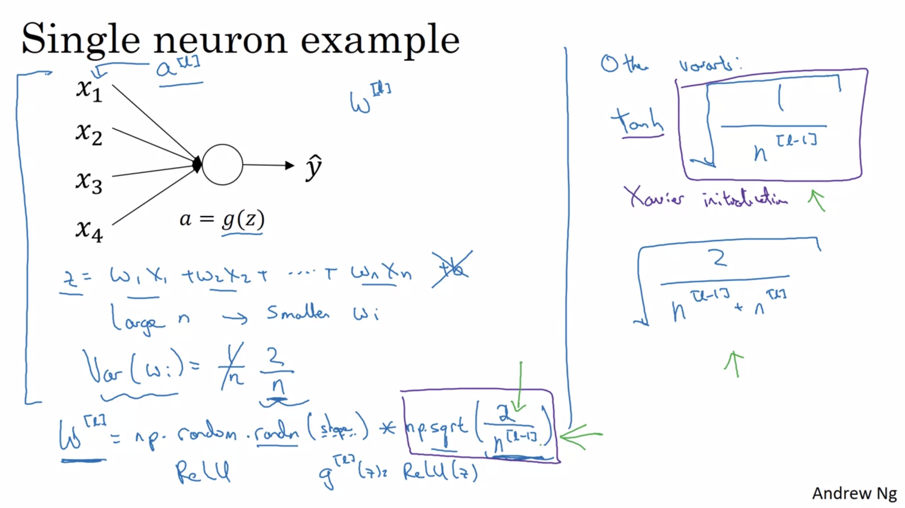

# Bias / Variance


### High Bias = Underfitting

```
Underfitting can be detected by looking at the training data performance,
if both training error and the testing error are very equally high.
So it's not even fitting the training data that well, then this is underfitting the data.
```

- **Solutions:**
    - Try bigger network
    - Train longer
    - Hyperparameters tuning
    - Try other advanc algorithems
    - Try different NN architecture


### High Variance = Overfitting
```
Overfitting can be detected by looking at the test set performance, 
If test error is much bigger the than train error, then there exist high variance.
Then the model is performing perfectly on the train set, but failed to generalize
well on the hold-out cross-validation set.
```

- **Solutions:**
    - Get more data
    - Regularization
    - Hyperparameters tuning
    - Drop out
    - Try different NN architecture

## bias variance tradeoff

```
we now have tools to drive down bias and just drive down bias, or drive down variance 
and just drive down variance, without really hurting the other thing that much.
```

---

# Frobenius norm Regularization

### We add add this extra term that penalizes the weight matrices from being too large.


> The limit of summation of i should be from 1 to n^[l], rows "i" of the matrix should be the number of neurons in the current layer n^[l].


> The limit of summation of j should be from 1 to n^[l-1], columns "j" of the weight matrix should equal the number of neurons in the previous layer n^[l-1]

```
NOTE: 
    When we increase lambda value, W will decrease (small numbers) causing Z to decrease as well,
    And if Z ends up taking relatively small values, so the activation function of Z, will be relatively linear.

    And so your whole neural network will be computing something not too far from a big linear function which is
    therefore pretty simple function rather than a very complex highly non-linear function.
```

# Gradient descent with regularization


---

# Dropout Regularization

```
In Dropout Regularization, On every iteration, you are randomly killing off a bunch of nodes.
If you're more worried about some layers overfitting than others, you can set a lower key prop for some layers than others.
```

```
NOTE:

One big downside of drop out is that the cost function J is no longer well-defined.
If you are double checking the performance of Gradient descent, it's actually harder to double check 
that you have a well defined cost function J that is going downhill on every iteration. Because the
cost function J that you're optimizing is actually less well defined, or is certainly hard to calculate.
```

```
NOTE:

Other downside is, this gives you even more hyper parameters to search for using cross-validation.
One other alternative might be to have some layers where you apply drop out and some layers where you don't apply drop out 
and then just have one hyper parameter, which is a key prop for the layers for which you do apply drop outs
```
---
# Other regularization methods

### Data Augmentation
### Early stopping 

---

# Normalizing inputs

## Why Normalizing ?

```
When data is Unnormalized, the cost function can be graphed as an elongated bowl, Then the gradient descent might need
a lot of steps to oscillate back and forth before it finally finds its way to the minimum.

After normalzing, we can get a more spherical shape for the cost function. Then, wherever we start, the gradient descent can
pretty much go straight to the minimum. That just makes our cost function J easier and faster to optimize.
```

```
So, if the input features came from very different scales, Normalizing guarantees that all the features will be 
on a similar scale and will usually help the learning algorithm run faster.
```

### 1) Subtract the mean and divide by std for each training and testing example
    - First calculate the mean and std from the training data
    - Use there values to normalize your train set as well as your test set.


> never scale train and test sets differently 
---

# Vanishing / Exploding gradients

```
When we training a very deep network, the derivatives can sometimes get either very, very big 
or very, very small, maybe even exponentially small, and this makes training difficult.
```
```
If our gradients are exponentially smaller than L, then gradient descent will take tiny little steps
so, it will take a long time for gradient descent to learn anything.

If our gradients are exponentially large, then the value of Y will explode.
```

## Solution: Weight Initialization for Deep Networks


---

# Gradient checking

```
When you implement back propagation you'll find that a test called gradient checking can help you 
make sure that your implementation of back prop is correct. Because sometimes you write all the equations
and you're just not 100% sure if you've got all the details right and internal back propagation.
```

## But about how to numerically approximate computations of gradients?


> So for technical reasons, the height over width of this bigger green triangle gives you a much better approximation to the derivative at theta.
> So rather than a one sided difference, you're taking a two sided difference.


- The network will have some sort of parameters, **W**
    - we take all of these **W** paramters, and reshape them into vectors, and then concatenate all of these things, so that you have a giant vector **theta**.

- We know that the cost function J being a function of the **W**s and **B**s 
    - we can now take dW[1], db[1] and so on, and initiate them into big, giant vector d-theta of the same dimension as theta.


### 1) compute "gradapprox" 
#### In a loop so that for each component of theta, compute ∂θ (two sided difference)


### 2) Then compute the gradient using backward propagation
#### and store the result in a variable "grad" 

### 3) Finally, compute the relative difference between "gradapprox" and the "grad" 
#### using the following formula:


##### If this difference is small (say less than **10−7**, you can be quite confident that you have computed your gradient correctly. Otherwise, there may be a mistake in the gradient computation.


- **Gradient checking - Implementation notes**
    - **Don’t** use Gradient checking in training – only to debug
    - If algorithm fails grad check, look at components to try to identify bug.
    - **Gradient checking Doesn’t** work with dropout
    - **Run** at random initialization; perhaps again after some training.
---

Resources ? 
-
- [https://upscfever.com/upsc-fever/en/data/deeplearning2/12.html](https://upscfever.com/upsc-fever/en/data/deeplearning2/12.html)